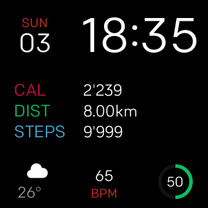
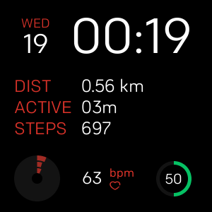
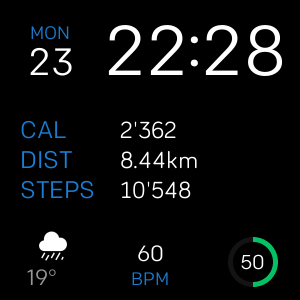

<h1 align="center">
  
</h1>
<h2 align="center">
  
</h2>

**Watchface Apfel** is a fitbit versa watchface inspired by the Human Interface Guidelines.

  
  
  

# Features

★ Digital clock

★ Day of the week and date

★ Three activity stats

★ Weather icon and temperature

★ Heartbeat monitor

★ Battery indicator

# Settings

In the settings menu you have the possibility to customize the watchface to your personal taste.

You can change the color theme in the settings to a single color.
[insert screen of settings]

Select which activities are displayed.
[inser screen of settings]

Choose if you want to use your gps location or a specific city for weather updates.
[insert screen of settings]

The weather indicator requires the smartphone to be paired and having access to the internet.
Weather information is requested from the openweathermap API.

#
