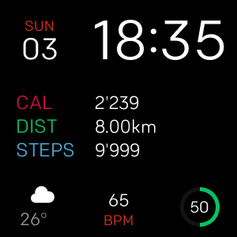

<h1 align="center">
  
</h1>
<h2 align="center">
  
</h2>

**Watchface Apfel** is a fitbit versa watchface inspired by the Human Interface Guidelines.

# Features

★ Digital clock

★ Day of the week and date

★ Three activity stats

★ Weather icon and temperature

★ Heartbeat monitor

★ Battery indicator

The weather indicator requires the smartphone to be paired and having access to the internet.
Weather information is requested from the openweathermap API.

#
<h1 align="center">
	

</h1>

 

	
	  
	<b>👨‍💻 Support me with a donation! </b>

 

---