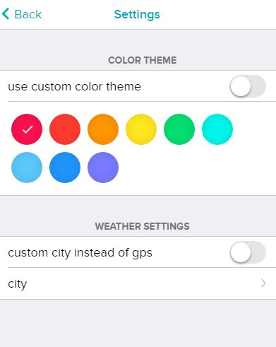

<h1 align="center">
  
</h1>
<h2 align="center">
  
</h2>

  <b>Clockface Apfel</b> is a fitbit versa watchface inspired by the Human Interface Guidelines.

  
  
  

# Features

★ Digital clock

★ Day of the week and date

★ Activity stats: calories, distance and steps

★ Weather icon and temperature (free api key required)

★ Heartbeat monitor

★ Battery indicator

# Settings

In the settings menu you have the possibility to customize the watchface to your personal taste.

  

The weather indicator requires the smartphone to be paired and having access to the internet.

Weather information is requested from the openweathermap API.

You need to register on https://openweathermap.org/appid for a free API-Key and add it in the watchface settings page.

#
